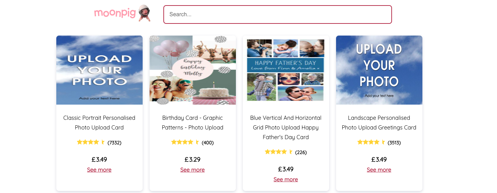
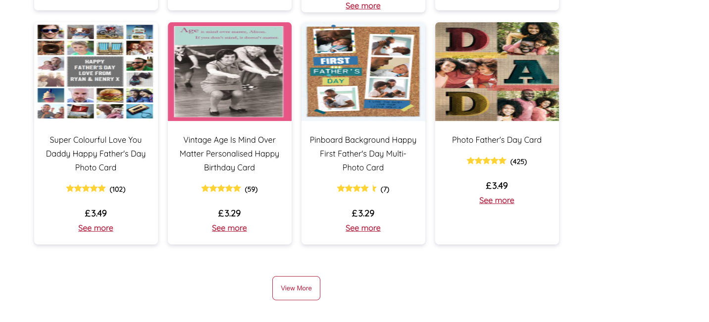
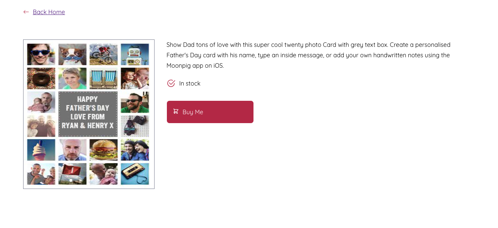

# Moonpig Frontend Technical Evaluation

## Table of Contents

- [Moonpig Frontend Technical Evaluation](#moonpig-frontend-technical-evaluation)
  - [Table of Contents](#table-of-contents)
  - [About](#about)
  - [Features](#features)
  - [Prerequisites](#prerequisites)
  - [Getting Started](#getting-started)
    - [Installation](#installation)
    - [Running the App](#running-the-app)
    - [Running Tests](#running-tests)
  - [Screenshots](#screenshots)

## About

Brief description of this Moonpig web application.

> A customer can view a list of available cards.

> A customer can also view more details of a card.

## Features

What users can do with the app

-   Search Cards
-   View Card Details
-   View Paginated of results
-   Responsive design enabled

## Prerequisites

List any prerequisites or dependencies that users need to have installed on their system before using your app. Include links to installation guides or documentation if necessary.

-   Node.js (version 18)
-   npm (version 9)

## Getting Started

Here's how to setup this application locally

### Installation

1. Clone this repository:

    ```bash
    git clone https://github.com/Hafizalimi7/moon_pig_test.git
    ```

2. Navigate to the project directory:

    ```bash
    cd MOON_PIG
    ```

3. Install project dependencies:

    ```bash
    npm install
    ```

### Running the App

Start the application locally

```bash
npm start
```

```bash for aws
npm run build && npm run deploy
```

Your app should now be running at `http://localhost:3000` ie. If the port is available
Or to view on amazon s3 http://mpig-test.s3-website.eu-west-2.amazonaws.com/

### Running Tests

Explain how to run tests for your React app using the following command:

```bash
npm run test
```

## Screenshots








